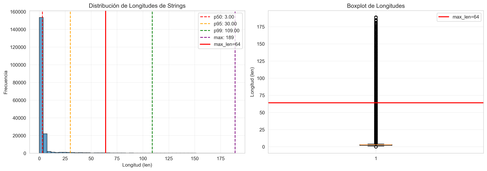
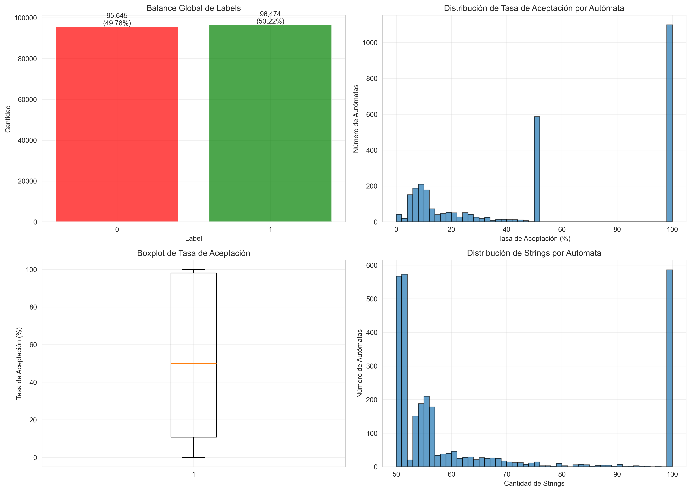
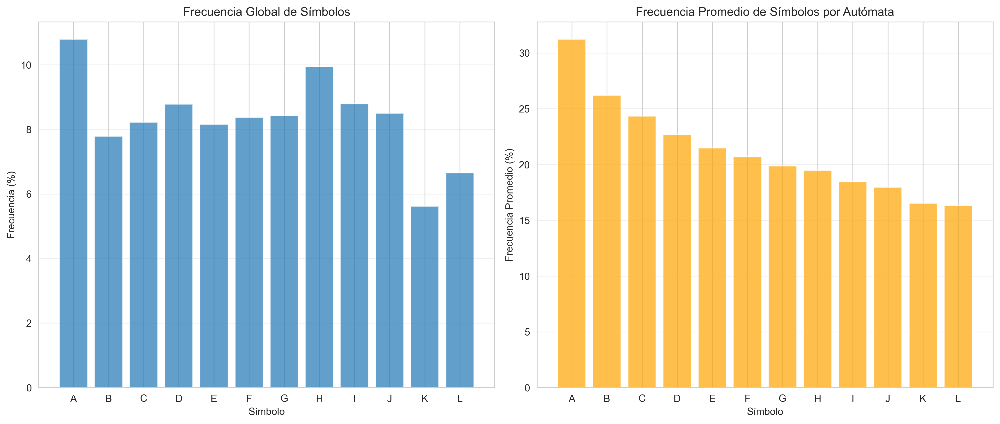
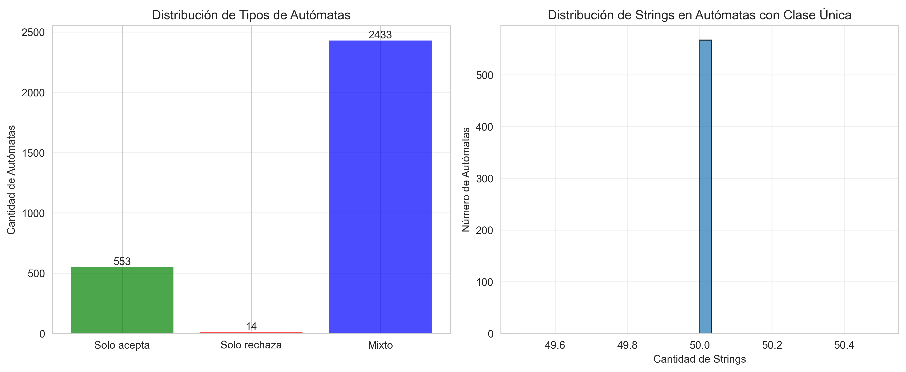

# EDA - Análisis Exploratorio de Datos

## Resumen Ejecutivo

Este reporte presenta un análisis exploratorio del dataset `dataset3000_flat_vc.csv`.

## 1. Distribución de Longitudes (len)

### Estadísticas Descriptivas

| Estadística | Valor |
|------------|-------|
| Media | 6.71 |
| Mediana (p50) | 3.00 |
| Percentil 95 (p95) | 30.00 |
| Percentil 99 (p99) | 109.00 |
| Máximo | 189 |
| Desviación Estándar | 17.83 |

### Justificación de max_len=64

⚠️ **El percentil 99 es 109.00, que está por encima de 64.**

Esto significa que aproximadamente el 1% de las strings exceden la longitud de 64.
El máximo encontrado es 189.

**Recomendación:** Considerar aumentar `max_len` o implementar estrategias de truncamiento
para strings muy largas si se pierde información crítica.

## 2. Balance de Labels (0/1)

### Balance Global

| Label | Cantidad | Porcentaje |
|-------|----------|------------|
| 0 (Rechazado) | 95,645 | 49.78% |
| 1 (Aceptado) | 96,474 | 50.22% |

✅ **El dataset está relativamente balanceado globalmente.**

### Balance por Autómata

**Autómatas desbalanceados (≥90% de un tipo):** 1709

Un autómata se considera desbalanceado si tiene más del 90% de strings aceptadas o rechazadas.

**Muestra de autómatas desbalanceados (primeros 10):**

| dfa_id | Total Strings | Aceptados | Rechazados | Tasa Aceptación (%) |
|--------|---------------|-----------|------------|---------------------|
| 0.0 | 51.0 | 50.0 | 1.0 | 98.04 |
| 1.0 | 50.0 | 50.0 | 0.0 | 100.00 |
| 2.0 | 50.0 | 50.0 | 0.0 | 100.00 |
| 3.0 | 55.0 | 5.0 | 50.0 | 9.09 |
| 6.0 | 55.0 | 5.0 | 50.0 | 9.09 |
| 7.0 | 51.0 | 50.0 | 1.0 | 98.04 |
| 9.0 | 52.0 | 2.0 | 50.0 | 3.85 |
| 10.0 | 50.0 | 50.0 | 0.0 | 100.00 |
| 11.0 | 50.0 | 50.0 | 0.0 | 100.00 |
| 13.0 | 51.0 | 50.0 | 1.0 | 98.04 |

## 3. Frecuencia de Símbolos

### Frecuencia Global

| Símbolo | Frecuencia (%) | Cantidad |
|---------|----------------|----------|
| A | 10.79% | 139,000 |
| B | 7.79% | 100,384 |
| C | 8.22% | 105,858 |
| D | 8.78% | 113,093 |
| E | 8.15% | 105,043 |
| F | 8.37% | 107,787 |
| G | 8.43% | 108,559 |
| H | 9.94% | 128,011 |
| I | 8.79% | 113,245 |
| J | 8.50% | 109,463 |
| K | 5.62% | 72,352 |
| L | 6.65% | 85,619 |

### Frecuencia Promedio por Autómata

| Símbolo | Frecuencia Promedio (%) |
|---------|------------------------|
| A | 31.22% |
| B | 26.19% |
| C | 24.34% |
| D | 22.67% |
| E | 21.48% |
| F | 20.69% |
| G | 19.86% |
| H | 19.45% |
| I | 18.46% |
| J | 17.95% |
| K | 16.51% |
| L | 16.33% |

**Observaciones:**

- Símbolo más frecuente: **A** (10.79%)
- Símbolo menos frecuente: **K** (5.62%)

## 4. Autómatas con Clase Única

### Resumen

- **Autómatas que solo aceptan (todos los labels son 1):** 553
- **Autómatas que solo rechazan (todos los labels son 0):** 14
- **Total de autómatas con clase única:** 567

**Impacto:**

- Estos autómatas representan el 18.90% del total de autómatas.

- Los autómatas que solo aceptan o solo rechazan pueden ser problemáticos para
  modelos de aprendizaje automático, ya que no proporcionan variabilidad en las
  etiquetas dentro del mismo autómata.

**Recomendaciones:**

1. Considerar filtrar estos autómatas si no aportan información útil.
2. Si se mantienen, asegurarse de que el modelo pueda manejar estos casos extremos.
3. Evaluar si estos autómatas representan casos reales o errores en la generación de datos.

**Ejemplos de autómatas que solo aceptan (primeros 5):**

| dfa_id | Total Strings |
|--------|---------------|
| 1 | 50 |
| 2 | 50 |
| 10 | 50 |
| 11 | 50 |
| 26 | 50 |

**Ejemplos de autómatas que solo rechazan (primeros 5):**

| dfa_id | Total Strings |
|--------|---------------|
| 123 | 50 |
| 136 | 50 |
| 615 | 50 |
| 681 | 50 |
| 712 | 50 |

## 5. Conclusiones y Decisiones

### Vocabulario

El vocabulario está compuesto por los símbolos: A, B, C, D, E, F, G, H, I, J, K, L

Estos símbolos representan las letras mayúsculas de A a L, que son válidas para los autómatas.
El símbolo especial `<EPS>` representa la cadena vacía.

### max_len

⚠️ **max_len=64 puede ser insuficiente** porque el percentil 99 (109.00) excede este valor.

**Recomendación:** Considerar aumentar `max_len` o implementar estrategias de truncamiento.

### Manejo de Casos Extremos

1. **Autómatas con clase única:**
   - Se encontraron 567 autómatas con clase única.
   - Considerar filtrar o manejar estos casos de manera especial.

2. **Autómatas desbalanceados:**
   - Se encontraron 1709 autómatas desbalanceados.
   - Considerar técnicas de balanceo o ponderación de muestras.

3. **Strings muy largas:**
   - Se encontraron strings con longitud máxima de 189.
   - Implementar truncamiento o padding para strings que excedan `max_len`.
